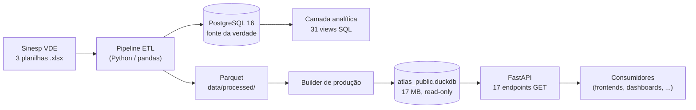

# 01 — Visão do Produto

> Navegação: [Índice](README.md) · Próximo → [Arquitetura](02-ARCHITECTURE.md)

## O que é o ATLAS

O **ATLAS — Public Safety Analytics Platform** é uma plataforma de engenharia
e análise de dados de segurança pública. Ele pega os dados estatísticos
oficiais do **Sinesp VDE** (Sistema Nacional de Informações de Segurança
Pública — Visualizador de Dados Estatísticos, do Ministério da Justiça e
Segurança Pública), publicados como planilhas Excel, e os transforma num
modelo analítico consultável por uma API REST.

> O ATLAS **não é** um produto oficial do Governo Federal. É um projeto
> independente de portfólio, construído com dados públicos oficiais, para
> demonstrar um pipeline analítico completo — de planilha bruta a API — com
> o rigor esperado de uma posição de Data / Analytics Engineer pleno.

### Em uma frase, para quem não é técnico

O Sinesp publica milhões de linhas de estatística criminal em planilhas
difíceis de usar. O ATLAS organiza esses números, confere que nada foi
perdido ou distorcido no caminho, e os disponibiliza de forma que um site,
um dashboard ou outro sistema consiga perguntar coisas como *"quantos roubos
de veículo o Rio de Janeiro registrou em 2025?"* e receber a resposta em
JSON, instantaneamente.

## Qual problema resolve

| Problema com o dado bruto | O que o ATLAS entrega |
|---|---|
| 3 planilhas Excel (~2 milhões de linhas) sem modelo, difíceis de cruzar | Um modelo dimensional (fato + dimensões) com 5,29 milhões de linhas em formato longo |
| Não dá para saber se um agregado está certo | Reconciliação evento a evento: RAW = FACT, 31/31 |
| "Não informado" e "não aplicável" se confundem e viram zero | As duas situações são distinguidas e contabilizadas; nada é preenchido com zero |
| Somar "vítimas + ocorrências + quilos de droga" produz números sem sentido | A API nunca soma indicadores de unidades diferentes |
| Comparar um ano completo com um ano parcial engana | Comparações ano a ano usam sempre o mesmo intervalo de meses |
| Publicar exige hospedar um banco de dados | Um arquivo DuckDB de 17 MB serve a API inteira, sem servidor de banco |

## Público-alvo

- **Consumidores de dados** (frontends, dashboards, notebooks, outros
  serviços) que precisam de indicadores de segurança pública já validados,
  sem ter de conhecer o Sinesp, SQL ou regras de agregação.
- **Analistas e pesquisadores** que querem uma base confiável com
  rastreabilidade da fonte.
- **Recrutadores e revisores técnicos** avaliando engenharia de dados de
  ponta a ponta.

## Proposta de valor

1. **Nada é inventado.** Toda classificação de indicador vem da observação
   real dos dados. Um evento não mapeado faz o pipeline falhar
   explicitamente, em vez de seguir com uma suposição.
2. **Rastreabilidade total.** Cada número na API pode ser rastreado até a
   linha da planilha original, passando por um relatório de reconciliação.
3. **Rigor semântico.** Unidades incompatíveis nunca são misturadas; anos
   parciais são sempre identificados; outliers são mostrados, nunca
   removidos.
4. **Barato de operar.** A separação entre o ambiente de engenharia
   (PostgreSQL) e o de publicação (DuckDB) permite servir a API em
   hospedagem gratuita, sem banco gerenciado.

## Principais capacidades (o que a API entrega)

| Capacidade | Endpoint(s) |
|---|---|
| Catálogo de indicadores e sua classificação | `/indicators` |
| KPIs agregados por indicador, com filtros | `/kpis` |
| Série temporal mensal | `/temporal` |
| Comparação ano a ano em período comparável | `/temporal/yoy` |
| Totais por UF e por município | `/geography/uf`, `/geography/municipalities` |
| Rankings (UF, município, indicador dentro do grupo) | `/rankings/*` |
| Radar de desvios em relação à média histórica (z-score) | `/radar` |
| Metadados do dataset e listas de valores para filtros | `/metadata`, `/metadata/*` |

Detalhe completo em [06 — Referência da API](06-API_REFERENCE.md).

## Arquitetura de alto nível

- **Desenvolvimento / engenharia**: PostgreSQL é a fonte da verdade. É onde o
  ETL carrega, onde a camada analítica é validada, e onde o Power BI se
  conecta.
- **Produção**: um dataset DuckDB read-only, derivado automaticamente dos
  mesmos dados, servido pela API. Sem PostgreSQL em produção.

Aprofundamento: [02 — Arquitetura](02-ARCHITECTURE.md).

## Fonte dos dados

Sinesp VDE — Ministério da Justiça e Segurança Pública. Três arquivos:
`BancoVDE 2024.xlsx`, `BancoVDE 2025.xlsx`, `BancoVDE 2026.xlsx`. Nenhum dado
externo, simulado ou de outra fonte é usado, com uma única exceção
documentada: o mapeamento oficial **UF → Região do IBGE** (estável e
público), necessário porque a fonte não traz a região.
