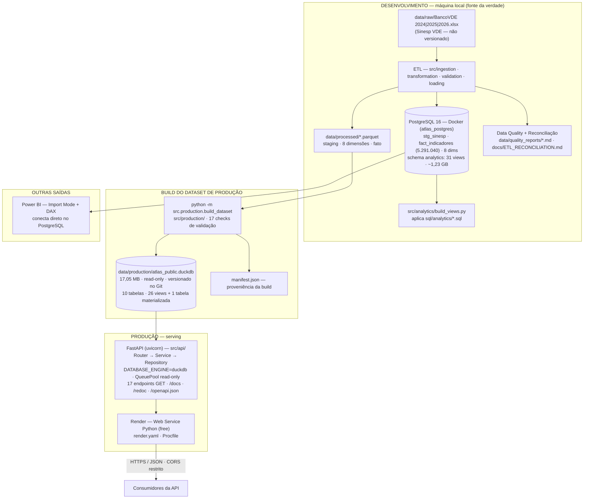
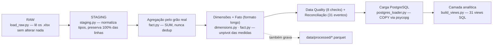
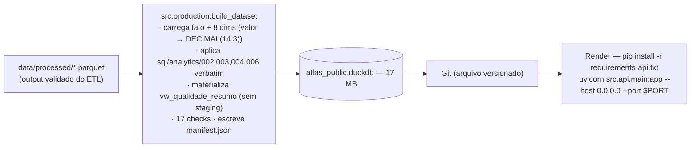
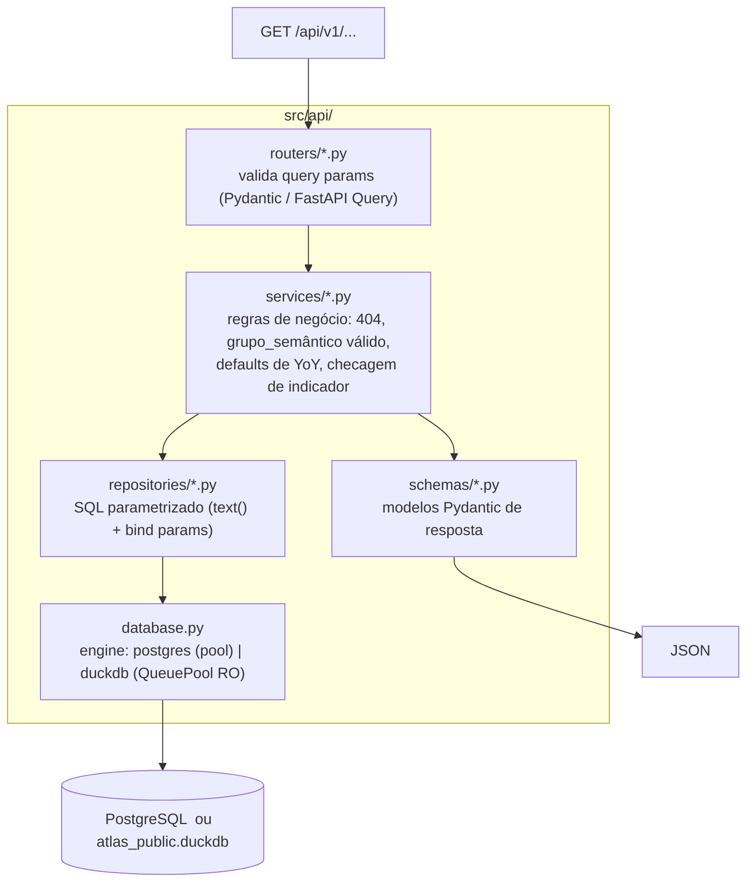

# 02 — Arquitetura

> Navegação: [Índice](README.md) · ← [Visão do produto](01-PRODUCT_OVERVIEW.md) · Próximo → [Arquitetura de dados](03-DATA_ARCHITECTURE.md)

## Princípio central: dois ambientes, uma fonte da verdade

O ATLAS separa deliberadamente **engenharia de dados** de **serving**:

| | Desenvolvimento / Engenharia | Produção / Serving |
|---|---|---|
| Banco | PostgreSQL 16 (Docker) | DuckDB (arquivo embarcado) |
| Papel | fonte da verdade — ETL, validação, analytics, Power BI | réplica read-only derivada, servida pela API |
| Origem dos dados | planilhas `.xlsx` → ETL | `data/processed/*.parquet` → builder |
| Escrita | sim (carga do ETL) | nunca (`read_only=True`) |
| Como se seleciona | `DATABASE_ENGINE=postgres` (padrão) | `DATABASE_ENGINE=duckdb` |
| Onde roda | máquina do desenvolvedor / CI | Render (ou qualquer host Python) |

O PostgreSQL **nunca sai da máquina de engenharia**. Produção nunca depende
dele. Ver [07 — Produção](07-PRODUCTION.md) para a mecânica dos dois modos.

## Visão geral do ecossistema

## Arquitetura de desenvolvimento

Orquestrado por `python -m src.run_etl`. Detalhe em
[04 — Pipeline ETL](04-ETL_PIPELINE.md).

## Arquitetura de produção

## Arquitetura da API

- **Router**: uma função por endpoint; validação de tipo/formato dos
  parâmetros é declarativa (FastAPI + Pydantic → 422 automático).
- **Service**: regras que não são SQL — 404 quando o indicador não existe,
  validação de `grupo_semantico`, defaults de `base_year`/`comparison_year`,
  cálculo da variação percentual.
- **Repository**: só SQL. Todo valor vindo do cliente é *bind parameter* —
  nunca concatenação de string. Alguns endpoints leem views prontas da
  camada analítica; outros (`/kpis`, `/temporal`, `/geography/*`) agregam
  `fact_indicadores` diretamente porque precisam de combinações de filtro
  que nenhuma view fixa cobre.
- **Schema**: contrato de saída. O que não está no schema não sai na
  resposta.

## Decisões arquiteturais

### Por que PostgreSQL no ambiente de engenharia

- Transações e `FOREIGN KEY` reais durante a carga (`fact_indicadores`
  referencia 8 dimensões).
- `UNIQUE INDEX ux_fact_grain` garante, no nível do banco, que o grão real
  validado nunca é violado por uma carga duplicada.
- `EXPLAIN ANALYZE`, `pg_stat_*`, `pg_depend` — ferramental maduro para
  auditar a camada analítica.
- Conecta com Power BI (Import Mode) sem intermediários.
- É o padrão que um time de dados espera encontrar.

### Por que DuckDB em produção

- **Tamanho**: a `fact_indicadores` ocupa ~969 MB no PostgreSQL (385 MB de
  dados + 586 MB de índices). Em DuckDB, colunar e comprimida, o dataset
  inteiro (fato + dimensões + views) são **17 MB**. O problema de tamanho
  desaparece.
- **Sem servidor**: DuckDB é embarcado no processo da API. Não há banco para
  hospedar, logo não há tier gratuito de banco para estourar. O deploy é uma
  unidade só (código + arquivo).
- **Performance de leitura**: nos endpoints que agregam a fato inteira
  (`/kpis`, `/rankings/*`, `/radar`), DuckDB foi 10–39× mais rápido que o
  PostgreSQL no mesmo hardware (benchmark real — ver [09 — Testes](09-TESTING.md)).
- **Dialeto compatível**: DuckDB fala um SQL quase idêntico ao PostgreSQL.
  Das 7 folhas de SQL analítico, 4 são aplicadas **sem nenhuma alteração**;
  o ajuste no código dos repositories foi trocar `CAST(:x AS CHAR(2))` por
  `CAST(:x AS VARCHAR)` (equivalente nos dois bancos).

### Qual problema essa arquitetura resolve

Publicar um produto de dados de portfólio **de graça, sem cartão de
crédito**, sem abrir mão do rigor de engenharia. O warehouse pesado fica
onde ele deve ficar (na engenharia); o que vai para a internet é um
artefato pequeno, imutável e reproduzível.

### Vantagens

- Custo de produção: R$ 0.
- Deploy trivial (um `git push`).
- Resultados idênticos aos do PostgreSQL — garantido por 25 testes de
  paridade que rodam a mesma query nos dois engines.
- Atualização de dados versionada: o `.duckdb` entra no histórico do Git
  junto com o código que o produz.

### Limitações

- **Atualização = redeploy.** Não há escrita em produção; dado novo exige
  rodar o ETL, reconstruir o `.duckdb` e fazer push. Adequado para dados
  mensais (a cadência do Sinesp), não para tempo real.
- **Concorrência.** Um processo, arquivo read-only. Ótimo para tráfego
  baixo/médio; escala horizontal é trivial (cada instância tem sua cópia),
  mas não há um banco central compartilhado.
- **Primeira query fria.** O processo parseia as 26 views na primeira
  consulta (~0,4 s); as seguintes são rápidas.
- **Free tier hiberna.** No plano gratuito do Render, o serviço dorme após
  ~15 min sem tráfego (cold start ~50 s).

## Fluxo de atualização dos dados

```mermaid
flowchart LR
    A["Novo BancoVDE 20XX.xlsx"] --> B["registrar em src/config.py (RAW_FILES)"]
    B --> C["python -m src.run_etl"]
    C --> D["python -m src.analytics.build_views"]
    D --> E["pytest  (89 testes, PostgreSQL)"]
    E --> F["python -m src.production.build_dataset"]
    F --> G["pytest tests/test_production_parity.py  (25 testes)"]
    G --> H["git commit do atlas_public.duckdb + manifest.json"]
    H --> I["git push → Render redeploy automático"]
    I --> J["validar /api/v1/health e /docs"]
```

Runbook detalhado: [10 — Atualização de dados](10-DATA_REFRESH.md).
