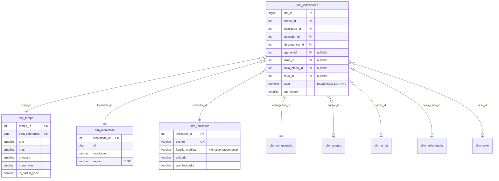

# 03 — Arquitetura de Dados

> Navegação: [Índice](README.md) · ← [Arquitetura](02-ARCHITECTURE.md) · Próximo → [Pipeline ETL](04-ETL_PIPELINE.md)

## Origem dos dados

| Item | Valor |
|---|---|
| Fonte | Sinesp VDE — Ministério da Justiça e Segurança Pública |
| Arquivos | `BancoVDE 2024.xlsx`, `BancoVDE 2025.xlsx`, `BancoVDE 2026.xlsx` |
| Localização | `data/raw/` (não versionado — ver `.gitignore`) |
| Aba lida | uma por arquivo, nomeada com o ano (`"2024"`, `"2025"`, `"2026"`) |
| Linhas totais (RAW) | **1.996.058** |
| Período coberto | Jan/2024 a Jun/2026 (2026 é ano parcial) |
| Única informação externa adicionada | mapeamento UF → Região (IBGE) |

### Colunas do arquivo fonte

`load_raw.py` exige estas 14 colunas em cada arquivo:

`uf`, `municipio`, `evento`, `data_referencia`, `agente`, `arma`,
`faixa_etaria`, `feminino`, `masculino`, `nao_informado`, `total_vitima`,
`total`, `total_peso`, `abrangencia`

> `total_vitima` é lida mas **descartada na staging** — é sempre derivável
> (`feminino + masculino + nao_informado`) e, por decisão de modelagem
> (Fase 0.5), nunca é persistida.

## Grão real dos dados

O "grão real" foi validado antes do ETL (ver
[`MODEL_VALIDATION.md`](MODEL_VALIDATION.md)). Uma linha da fonte representa
uma combinação de:

```
uf · municipio · evento · data_referencia · abrangencia · agente · arma · faixa_etaria · ano_origem
```

**Linhas com essa chave repetida NÃO são duplicatas** — são agregadas com
`SUM` (`src/transformation/fact.py`), nunca removidas. O caso mais comum é o
**Distrito Federal**: o DF não tem municípios, e a fonte reporta um nível
mais granular que colapsa em "Brasília" no export. Remover essas "duplicatas"
subcontaria a criminalidade da capital federal.

Da agregação por grão real resultam **~197 mil combinações únicas**, que
depois são "despivotadas" (unpivot) para o formato longo da fact table.

## Modelo dimensional (esquema estrela, formato longo)



`dim_abrangencia`, `dim_agente`, `dim_arma`, `dim_faixa_etaria`, `dim_sexo`
seguem o mesmo padrão: `<nome>_id` (PK inteiro) + o rótulo (`UNIQUE`).

### Por que "formato longo"

A fact table **não guarda `total_vitima`**. Um evento da família `vitima` é
representado por até **3 linhas** — uma por sexo (`Feminino`, `Masculino`,
`Não Informado`), cada uma com seu `valor`. O "total de vítimas" é sempre
`SUM(valor)` sem filtro de sexo, calculado sob demanda — nunca uma coluna
armazenada (evita dupla contagem).

Consequência: **~94% das 5,29 milhões de linhas da fato são quebras por
sexo** de eventos da família `vitima`.

### As 5 colunas de medida → o unpivot

| Coluna de origem | Vira linha na fato quando não-nula | `sexo_id` da linha |
|---|---|---|
| `feminino` | sim | Feminino |
| `masculino` | sim | Masculino |
| `nao_informado` | sim | Não Informado |
| `total` | sim | `NULL` |
| `total_peso` | sim | `NULL` |

Célula **nula** é **omitida** da fato (nunca vira linha com `valor = 0`). O
nulo tem duas causas, ambas tratadas igual (omitir) mas contadas
separadamente no relatório de qualidade:

- **não aplicável** — o evento não pertence àquela família (ex.: `total`
  sempre nulo para eventos `vitima`). Estrutural, 100% esperado.
- **não informado** — o evento é da família, mas o valor não foi reportado
  para aquela combinação de dimensões. Real: 1,8%–8,3% dentro da família
  aplicável (ver [`DATA_QUALITY_REPORT`](../data/quality_reports/DATA_QUALITY_REPORT.md)).

## Cardinalidades (verificadas)

| Objeto | Linhas | Observação |
|---|--:|---|
| `stg_sinesp` (RAW/staging) | 1.996.058 | idêntico ao RAW |
| Grão real agregado (intermediário) | ~197.039 | `SUM` por grão |
| `fact_indicadores` | **5.291.040** | após unpivot para formato longo |
| `dim_tempo` | 30 | meses de 2024-01 a 2026-06 |
| `dim_localidade` | 5.597 | combinações UF+município |
| `dim_indicador` | 31 | eventos classificados |
| `dim_abrangencia` | 3 | Estadual, Polícia Federal, Polícia Rodoviária Federal |
| `dim_agente` | 9 | |
| `dim_arma` | 9 | |
| `dim_faixa_etaria` | 3 | |
| `dim_sexo` | 3 | Feminino, Masculino, Não Informado |
| UFs distintas | 27 | 26 estados + DF |
| Municípios distintos | 5.298 | (5.597 combinações UF+município) |

## Os 31 indicadores

Classificados em `src/transformation/reference_data.py` a partir da
observação de qual coluna da fonte popula o valor (`familia_medida`):

| `familia_medida` | Nº | O que preenche `valor` | Exemplos |
|---|--:|---|---|
| `vitima` | 17 | `feminino` / `masculino` / `nao_informado` (unpivot em sexo) | Homicídio doloso, Feminicídio, Estupro, Suicídio, Morte por intervenção de Agente do Estado, Pessoa Desaparecida/Localizada |
| `contagem` | 12 | `total` | Roubo de veículo, Furto de veículo, Tráfico de drogas, Mandado de prisão cumprido, Arma de Fogo Apreendida, Combate a incêndios, Atendimento pré-hospitalar |
| `peso` | 2 | `total_peso` | Apreensão de Cocaína, Apreensão de Maconha |

### Unidades (`unidade`, nunca convertidas)

`pessoas` · `ocorrências` · `mandados` · `armas (unidades)` · `atendimentos`
· `operações` · `alvarás` · `vistorias` · `kg (não confirmado pela fonte)`

> O peso das apreensões aparece como "kg" mas a fonte não confirma a unidade
> — por isso o rótulo `kg (não confirmado pela fonte)`. O valor nunca é
> convertido.

### `grupo_semantico` (derivado, não persistido)

Agrupamento de 6 categorias calculado na camada analítica a partir de
`tipo_indicador`:

`Vítimas` · `Ações Policiais` · `Ocorrências` · `Apreensões (Peso)` ·
`Apreensões (Unidade)` · `Serviços`

Usado por `/indicators` e `/rankings/indicators`. Um ranking de indicadores
só compara dentro do mesmo `grupo_semantico` — nunca cross-grupo, porque as
unidades diferem.

## Regras de somabilidade

1. **Nunca somar entre `familia_medida` / `unidade` diferentes** (pessoas +
   ocorrências + kg). A API garante isso: cada linha de `/kpis` é de um
   único indicador.
2. **Exceção deliberada**: `/radar` retorna indicadores de unidades
   diferentes juntos, porque `z_score` é um valor padronizado (adimensional),
   legitimamente comparável entre indicadores.
3. **Duplicatas se agregam com `SUM`, nunca se descartam.**
4. **Ano parcial nunca é comparado a ano completo** sem normalização de
   período (`/temporal/yoy`).
5. **Outliers nunca são removidos** — a camada analítica mostra o efeito
   deles (ver `analytics.vw_pesos_impacto_outliers`).
