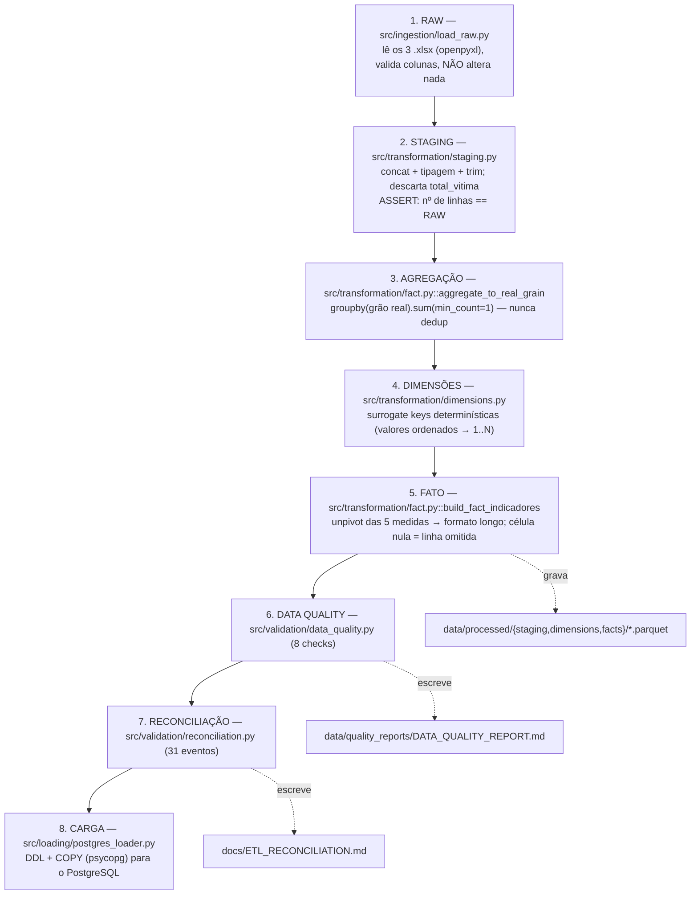

# 04 — Pipeline ETL

> Navegação: [Índice](README.md) · ← [Arquitetura de dados](03-DATA_ARCHITECTURE.md) · Próximo → [Banco de dados](05-DATABASE.md)

Orquestrador: **`python -m src.run_etl`** (`src/run_etl.py`).

## Fluxo



## Etapa 1 — RAW (`src/ingestion/load_raw.py`)

- Lê `data/raw/BancoVDE <ano>.xlsx`, aba nomeada com o ano.
- Valida que as 14 colunas esperadas existem; falha explícita se faltar
  alguma.
- **Não transforma nada.** Os arquivos originais nunca são escritos.
- Retorna `dict[int, DataFrame]` (um por ano).

## Etapa 2 — STAGING (`src/transformation/staging.py`)

- Concatena os 3 anos, adicionando a coluna `ano_origem`.
- Colunas de texto → `string` + `str.strip()`.
- Colunas de medida → `pd.to_numeric(errors="raise")` (falha se houver lixo).
- `data_referencia` → `datetime` normalizado (meia-noite).
- **Remove `total_vitima`** (derivável, não persistida).
- **Invariante dura**: `len(staging) == len(raw)`. Se a staging mudar a
  contagem de linhas, o ETL aborta com `AssertionError`. Verificado também
  em `tests/test_staging.py`.
- Resultado: `stg_sinesp` com **1.996.058 linhas** e 14 colunas.

## Etapa 3 — Agregação pelo grão real (`fact.py::aggregate_to_real_grain`)

```python
grouped = stg.groupby(GRAIN_COLS, dropna=False, sort=False, observed=True)
agg = grouped[MEASURE_COLS].sum(min_count=1).reset_index()
```

- `GRAIN_COLS`: `uf, municipio, evento, data_referencia, abrangencia, agente,
  arma, faixa_etaria, ano_origem`.
- `min_count=1`: se **todas** as linhas de origem daquela célula são nulas,
  a soma continua **nula** (preserva a distinção "soma zero" × "não
  informado").
- ~1,99 M linhas de staging → **~197 mil linhas de grão único**. A diferença
  são linhas combinadas por `SUM` dentro da mesma chave (o padrão DF).

## Etapa 4 — Dimensões (`src/transformation/dimensions.py`)

- **Surrogate keys determinísticas**: valores únicos ordenados → `1..N`. O
  mesmo dado fonte produz sempre os mesmos IDs (reprodutível entre
  execuções).
- `dim_tempo`: `is_partial_year` é **calculado dos dados** — um ano é parcial
  se tem `< 12` meses distintos na fonte. Não é hardcoded para 2026.
- `dim_localidade`: `regiao` vem do mapa `UF_REGIAO` (IBGE). UF sem região
  mapeada → falha explícita (`validate_uf_coverage`).
- `dim_indicador`: classificação vem de
  `reference_data.INDICADOR_CLASSIFICATION`. Evento não mapeado → falha
  explícita (`validate_evento_coverage`) — **nunca** classificação inventada.
- `dim_sexo`: fixa (`Feminino`, `Masculino`, `Não Informado`).

## Etapa 5 — Fato (`fact.py::build_fact_indicadores`)

1. Mapeia cada coluna do grão para sua surrogate key (left-join que preserva
   `NaN` quando o valor de origem é nulo = "não aplicável").
2. `localidade_id`, `indicador_id`, `abrangencia_id` **não podem ser nulos**
   → `AssertionError` se o join falhar.
3. Unpivot: para cada uma das 5 colunas de medida, gera uma linha por célula
   **não-nula** (`mask = agg[value_col].notna()`).
   - `feminino`/`masculino`/`nao_informado` → `sexo_id` correspondente.
   - `total`/`total_peso` → `sexo_id = NULL`.
4. Tipagem final: FKs obrigatórias `int64`; FKs opcionais `Int64` (nullable);
   `ano_origem` `int16`; `valor` `float64`.
5. **Invariantes duras**: nenhum `valor` negativo; nenhum `valor` nulo
   (linhas sem valor devem ter sido omitidas antes).
6. Resultado: **5.291.040 linhas**.

## Etapa 6 — Data Quality (`src/validation/data_quality.py`)

8 checks estruturais (`run_all_checks`), cada um retorna `PASS`/`FAIL`:

| # | Check | Regra |
|---|---|---|
| 1 | Contagem de linhas | `STAGING == RAW` |
| 2 | Unicidade do grão final | 0 linhas com chave de grão duplicada |
| 3 | Valores negativos | 0 |
| 4 | Campos obrigatórios sem nulos | `tempo_id`, `localidade_id`, `indicador_id`, `abrangencia_id`, `valor` |
| 5 | Consistência de sexo | `vitima` sempre tem `sexo_id`; `contagem`/`peso` nunca têm |
| 6 | Família por indicador | cada indicador aparece com exatamente uma `familia_medida` |
| 7 | Unidade preenchida | toda linha de `dim_indicador` tem `unidade` |
| 8 | Consistência temporal | meses contínuos por ano; `is_partial_year` correto; sem datas duplicadas |

Além disso, `compute_nao_informado_stats` conta, por evento, quantas células
de grão real ficaram sem valor **dentro da família aplicável** (o "não
informado" real). Tudo é escrito em
`data/quality_reports/DATA_QUALITY_REPORT.md`.

## Etapa 7 — Reconciliação (`src/validation/reconciliation.py`)

Para cada um dos **31 eventos**, compara três somas:

- **RAW** — soma direta nos 3 arquivos, usando a família de medida correta.
- **STAGING** — mesma soma sobre `stg_sinesp`.
- **FACT** — `SUM(valor)` na `fact_indicadores` para aquele `indicador_id`.

Tolerância: `1e-6` (acumulação de ponto flutuante em `total_peso`). Qualquer
diferença maior → status `FAIL`, reportado, nunca escondido. Resultado atual:
**31/31 PASS** (`RAW == STAGING == FACT`). Escrito em
[`docs/ETL_RECONCILIATION.md`](ETL_RECONCILIATION.md).

## Etapa 8 — Carga no PostgreSQL (`src/loading/postgres_loader.py`)

- Executa o DDL: `sql/staging/`, `sql/dimensions/`, `sql/facts/`.
- Carrega via `COPY` (psycopg) — necessário para ~5,3 M linhas em tempo
  hábil (INSERT linha a linha seria inviável).
- Ordem: `stg_sinesp` → dimensões → `fact_indicadores` (respeita as FKs).
- **Best-effort**: se o PostgreSQL estiver indisponível, o pipeline de
  arquivos Parquet ainda é válido e o `run_etl` não aborta (loga o erro).

## Camada analítica (pós-ETL)

`python -m src.analytics.build_views` (`src/analytics/build_views.py`) aplica
`sql/analytics/*.sql` — cria o schema `analytics` e suas 31 views. **Não
toca** em `stg_sinesp`, dimensões ou `fact_indicadores`. Catálogo completo
em [`ANALYTICS_MODEL.md`](ANALYTICS_MODEL.md) e resumido em
[05 — Banco de dados](05-DATABASE.md).

## Saída em Parquet

Durante o ETL, `run_etl` também grava:

```
data/processed/staging/stg_sinesp.parquet
data/processed/dimensions/dim_*.parquet   (8 arquivos)
data/processed/facts/fact_indicadores.parquet
```

Total ~3,3 MB. **É a entrada do builder de produção** (ver
[07 — Produção](07-PRODUCTION.md)) — o builder não precisa do PostgreSQL no ar.

## Resumo retornado por `run_etl`

`main()` devolve um `dict` com: `n_raw`, `n_staging`, `n_grain_real`,
`n_fact`, `n_indicadores`, `n_ufs`, `n_municipios`, `periodo_min`,
`periodo_max`, `anos_parciais`, `dq_checks_pass`/`_total`,
`reconciliation_pass`/`_total`, `postgres_status`, `elapsed_minutes`. O
processo sai com código `1` se algum check de qualidade ou de reconciliação
falhar.
