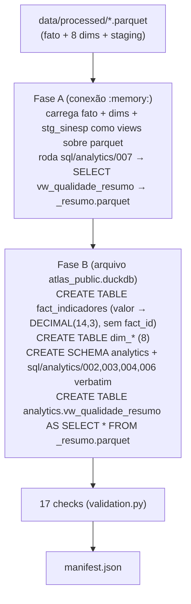

# 07 — Produção (PostgreSQL × DuckDB)

> Navegação: [Índice](README.md) · ← [Referência da API](06-API_REFERENCE.md) · Próximo → [Deploy](08-DEPLOYMENT.md)

A API tem **dois modos de banco**, selecionados pela variável
`DATABASE_ENGINE`. O código dos repositories, services e routers é o mesmo
nos dois — muda apenas a criação do engine (`src/api/database.py`).

| | `DATABASE_ENGINE=postgres` (padrão) | `DATABASE_ENGINE=duckdb` |
|---|---|---|
| Uso | desenvolvimento, testes, engenharia | produção / serving |
| Banco | PostgreSQL 16 (Docker) | `data/production/atlas_public.duckdb` |
| URL do engine | `postgresql+psycopg://...` | `duckdb:///<DUCKDB_PATH>` |
| Escrita | possível (mas a API só faz `SELECT`) | **impossível** (`read_only=True`) |
| Pool | `QueuePool` (`pool_size=5`, `max_overflow=10`, `pool_pre_ping`) | `QueuePool` (`pool_size=4`, `max_overflow=8`) — conexões persistentes |
| Dependências de runtime | `psycopg[binary]` + tudo do `requirements.txt` | `requirements-api.txt` (sem pandas/numpy/psycopg) |

Auditado: com `DATABASE_ENGINE=duckdb`, `import src.api.main` **não carrega**
`psycopg`, `psycopg2`, `pandas` nem `numpy`.

## Comportamento

### `src/api/config.py`

```python
database_engine = os.environ.get("DATABASE_ENGINE", "postgres").strip().lower()
duckdb_path     = os.environ.get("DUCKDB_PATH", "<repo>/data/production/atlas_public.duckdb")

@property
def database_url(self) -> str:
    if self.is_duckdb:
        return f"duckdb:///{self.duckdb_path}"
    return f"postgresql+psycopg://{user}:{pwd}@{host}:{port}/{db}"
```

### `src/api/database.py`

```python
if settings.is_duckdb:
    engine = create_engine(
        settings.database_url,
        connect_args={"read_only": True},
        poolclass=QueuePool, pool_size=4, max_overflow=8, pool_recycle=-1,
    )
else:
    engine = create_engine(
        settings.database_url,
        pool_pre_ping=True, pool_size=5, max_overflow=10,
    )
```

`check_database_connection()` (usado por `/health`) roda `SELECT 1` no engine
ativo — vale para os dois modos. Em modo DuckDB, `database: "connected"`
significa "o arquivo `.duckdb` abriu e respondeu".

### Connection pooling (DuckDB)

Abrir o arquivo DuckDB custa ~15–20 ms (catálogo + parse das 26 views). Com
`NullPool` (uma conexão por request) isso dominava a latência dos endpoints
leves. Com `QueuePool` e conexões persistentes, os endpoints leves voltam
para ~10 ms. Conexões DuckDB são thread-safe (serializam internamente).

## Configuração de produção

| Variável | Valor de produção | Origem |
|---|---|---|
| `DATABASE_ENGINE` | `duckdb` | `render.yaml` |
| `DUCKDB_PATH` | `data/production/atlas_public.duckdb` | `render.yaml` (é o default) |
| `CORS_ORIGINS` | domínios permitidos, separados por vírgula — **nunca `*`** | `render.yaml` |
| `PYTHON_VERSION` | `3.11.9` | `render.yaml` |

Detalhe de cada variável em
[11 — Variáveis de ambiente](11-ENVIRONMENT_VARIABLES.md).

## O builder — `python -m src.production.build_dataset`

Pacote `src/production/`:

| Arquivo | Papel |
|---|---|
| `build_dataset.py` | orquestra a construção do `atlas_public.duckdb` |
| `validation.py` | 17 checks (estruturais + invariantes analíticas) |
| `manifest.py` | escreve `data/production/manifest.json` |

### O que o builder faz



**Por que duas fases**: DuckDB não recupera espaço em disco após `DROP
TABLE`. Carregar a `stg_sinesp` (213 MB) no arquivo final e depois dropá-la
deixaria o arquivo inchado (~42 MB). Calculando a `vw_qualidade_resumo`
numa conexão `:memory:` separada, a staging **nunca toca o arquivo final**
→ 17 MB.

### 17 checks de validação

Fato no grão completo (5.291.040) · staging ausente · 8 dimensões presentes
· cada uma das 10 views da API responde a `SELECT` · `vw_qualidade_resumo`
materializada (1 linha, sem staging) · 2026 é ano parcial de 6 meses ·
1 `familia_medida` por indicador · anomalia do radar preservada
(`z ≈ 3.03`). Sai com código ≠ 0 se qualquer check falhar.

### Manifesto (`data/production/manifest.json`)

```json
{
  "dataset": "atlas_public",
  "built_at": "2026-08-30T20:27:49+00:00",
  "duckdb_engine_version": "1.5.5",
  "file": { "size_bytes": 17051648, "size_mb": 17.05 },
  "source_parquets": [ { "name": "fact_indicadores.parquet", "sha256": "...", "size_bytes": 1939580 }, ... ],
  "tables": { "fact_indicadores": 5291040, "dim_localidade": 5597, ... },
  "views": [ "analytics.vw_ranking_uf", ... ]
}
```

## Fluxo completo até produção

```
python -m src.run_etl
        ↓  (grava data/processed/*.parquet + carrega PostgreSQL)
python -m src.analytics.build_views
        ↓  (31 views no PostgreSQL)
pytest                              # 89 testes contra PostgreSQL
        ↓
python -m src.production.build_dataset
        ↓  data/production/atlas_public.duckdb  (17 MB)
pytest tests/test_production_parity.py   # 25 testes: PostgreSQL == DuckDB
        ↓
git commit  (do .duckdb + manifest.json)
        ↓
git push  →  Render redeploy automático
        ↓
curl https://sentinel-api-sjie.onrender.com/api/v1/health
```

## Limitações do modo DuckDB

- Atualização de dados = rebuild + redeploy (não há escrita).
- Primeira query do processo: +~0,4 s (parse das views).
- Endpoints de ponto (`/kpis` filtrado, `/temporal`, `/geography`) são
  ~3–6 ms mais lentos que no PostgreSQL (sem índice b-tree; varredura
  vetorizada). Absoluto < 20 ms.
- Um processo por instância; sem banco central compartilhado. Escala
  horizontal é trivial (cada instância tem sua cópia read-only).

Ganhos e trade-offs completos em
[02 — Arquitetura › Decisões arquiteturais](02-ARCHITECTURE.md#decisões-arquiteturais).
