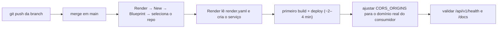

# 08 — Deploy

> Navegação: [Índice](README.md) · ← [Produção](07-PRODUCTION.md) · Próximo → [Testes](09-TESTING.md)

A API é publicada como um **Web Service Python** no Render, servindo o
dataset DuckDB versionado no repositório. **Não há banco de dados
provisionado** — sem PostgreSQL, sem Docker obrigatório, sem serviço pago.

- **URL da API**: `https://sentinel-api-sjie.onrender.com`
- **Base URL**: `https://sentinel-api-sjie.onrender.com/api/v1`
- **Swagger**: `https://sentinel-api-sjie.onrender.com/docs`

## Arquivos de deploy

### `render.yaml` (raiz do repositório)

```yaml
services:
  - type: web
    name: sentinel-api
    runtime: python
    plan: free
    region: oregon
    buildCommand: pip install -r requirements-api.txt
    startCommand: uvicorn src.api.main:app --host 0.0.0.0 --port $PORT
    healthCheckPath: /api/v1/health
    autoDeploy: true
    envVars:
      - key: PYTHON_VERSION
        value: "3.11.9"
      - key: DATABASE_ENGINE
        value: duckdb
      - key: DUCKDB_PATH
        value: data/production/atlas_public.duckdb
      - key: CORS_ORIGINS
        value: http://localhost:3000,https://<dominio-do-consumidor>
```

**Não contém bloco `databases:`** — é intencional.

### `Procfile` (raiz do repositório)

```
web: uvicorn src.api.main:app --host 0.0.0.0 --port $PORT
```

Portabilidade: o mesmo projeto sobe em Koyeb, Railway ou qualquer plataforma
que respeite `Procfile` + `$PORT`. O código não depende do Render.

## Configuração no Render

| Item | Valor |
|---|---|
| Tipo | Web Service |
| Runtime | Python (nativo, não Docker) |
| Plano | Free |
| Região | Oregon |
| Build command | `pip install -r requirements-api.txt` |
| Start command | `uvicorn src.api.main:app --host 0.0.0.0 --port $PORT` |
| Python | 3.11.9 (`PYTHON_VERSION`) |
| Health check | `/api/v1/health` |
| Auto-deploy | on (todo push na branch acompanhada redeploya) |

### Variáveis de ambiente no Render

`DATABASE_ENGINE=duckdb` · `DUCKDB_PATH=data/production/atlas_public.duckdb` ·
`CORS_ORIGINS=<domínios permitidos>` · `PYTHON_VERSION=3.11.9`

Nenhum segredo é necessário (sem banco, sem auth). **Nunca** commitar
valores reais de `CORS_ORIGINS` que exponham domínios privados — use
placeholders no `render.yaml` e defina o valor real no painel do Render.

## O dataset DuckDB no deploy

`data/production/atlas_public.duckdb` (~17 MB) **é versionado no Git**
(`.gitignore` libera especificamente esse arquivo + `manifest.json`; o resto
de `data/production/` continua ignorado). O repositório é o artefato de
deploy: o Render clona o repo e o arquivo já está lá.

Alternativas para datasets maiores no futuro: Git LFS ou download de object
storage no boot via `DUCKDB_PATH`.

## Passos para publicar (primeira vez)



## Redeploy (atualização de dados)

Automático: `git push` com o `atlas_public.duckdb` novo → Render detecta →
rebuild + deploy. Ver [10 — Atualização de dados](10-DATA_REFRESH.md).

## Limitações do plano gratuito do Render

| Limitação | Detalhe | Mitigação |
|---|---|---|
| Hibernação | dorme após ~15 min sem tráfego | cold start ~50 s na volta |
| Cold start do DuckDB | +~0,4 s na 1ª query do processo (parse das views) | inerente; aceitável |
| RAM | 512 MB | folgado (API + arquivo de 17 MB) |
| CPU | 0,1 vCPU compartilhada | DuckDB compensa (agregações 10–39× mais rápidas que PostgreSQL) |
| Horas | 750 horas-instância/mês | 1 serviço 24/7 cabe |
| Disco | efêmero | ok — o `.duckdb` vem do repo, não é gerado em runtime |
| Domínio | `*.onrender.com` (sem domínio custom no free) | — |

## Rodar produção localmente (validação pré-deploy)

Com Docker/PostgreSQL **desligados**:

```bash
DATABASE_ENGINE=duckdb \
DUCKDB_PATH=data/production/atlas_public.duckdb \
CORS_ORIGINS=http://localhost:3000 \
uvicorn src.api.main:app --host 0.0.0.0 --port 8000

curl http://localhost:8000/api/v1/health          # {"status":"ok",...}
open http://localhost:8000/docs
```

Verificado: os 17 endpoints + `/docs` + `/redoc` respondem 200 sem
PostgreSQL no ar.
