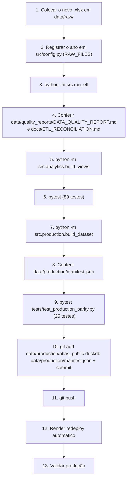

# 10 — Runbook: Atualização de Dados

> Navegação: [Índice](README.md) · ← [Testes](09-TESTING.md) · Próximo → [Variáveis de ambiente](11-ENVIRONMENT_VARIABLES.md)

Procedimento para publicar uma nova versão dos dados (novo `BancoVDE
20XX.xlsx`, ou correção). Todos os comandos abaixo foram confirmados no
projeto.

## Pré-requisitos

- PostgreSQL de desenvolvimento no ar (`docker compose up -d`).
- Dependências completas instaladas (`pip install -r requirements.txt`).
- Os 3+ arquivos `BancoVDE <ano>.xlsx` em `data/raw/`.

## Fluxo



## Passo a passo

### 1–2. Novo arquivo + registro

```bash
cp "BancoVDE 2027.xlsx" data/raw/
```

Editar `src/config.py`:

```python
RAW_FILES = {
    2024: DATA_RAW_DIR / "BancoVDE 2024.xlsx",
    2025: DATA_RAW_DIR / "BancoVDE 2025.xlsx",
    2026: DATA_RAW_DIR / "BancoVDE 2026.xlsx",
    2027: DATA_RAW_DIR / "BancoVDE 2027.xlsx",   # ← nova linha
}
```

O ETL falha explicitamente para um ano não registrado — nunca assume.

### 3. Rodar o ETL

```bash
python -m src.run_etl
```

Executa RAW → STAGING → agregação → dimensões → fato → data quality →
reconciliação → carga PostgreSQL, e grava `data/processed/*.parquet`. O
processo sai com código `1` se algum check falhar.

### 4. Conferir qualidade e reconciliação

```bash
cat data/quality_reports/DATA_QUALITY_REPORT.md   # 8 checks PASS
cat docs/ETL_RECONCILIATION.md                    # todos os eventos PASS
```

Se um **evento novo** aparecer sem classificação, o ETL para em
`validate_evento_coverage` — atualizar
`src/transformation/reference_data.INDICADOR_CLASSIFICATION` com base na
observação real dos dados (nunca chutar) e rodar de novo.

### 5. Camada analítica

```bash
python -m src.analytics.build_views
```

### 6. Testes (PostgreSQL)

```bash
pytest
```

Baseline: **89 passed**. A fixture de ano parcial em `conftest.py` cobre a
lógica de `is_partial_year`, então 2027 parcial e 2026 deixando de ser o
"último ano" são absorvidos automaticamente.

### 7. Build do dataset de produção

```bash
python -m src.production.build_dataset
```

Gera `data/production/atlas_public.duckdb` + `manifest.json`. Roda 17 checks;
sai ≠ 0 se algum falhar.

### 8. Conferir o manifesto

```bash
python -c "import json; m=json.load(open('data/production/manifest.json')); print(m['file']['size_mb'],'MB'); print(m['tables'])"
```

Esperado: `fact_indicadores` com a nova contagem, 8 `dim_*`,
`analytics.vw_qualidade_resumo: 1`, ~26 views.

### 9. Testes de paridade (PostgreSQL × DuckDB)

```bash
pytest tests/test_production_parity.py     # 25 passed
```

Garante que o DuckDB novo devolve exatamente os mesmos números que o
PostgreSQL para todos os endpoints.

### 10–11. Commit e push

```bash
git add data/production/atlas_public.duckdb data/production/manifest.json src/config.py
git commit -m "Atualiza dataset: BancoVDE 2027"
git push
```

> Autorização humana obrigatória para commit/push — não é automatizado.

### 12. Redeploy

Automático (`autoDeploy: true` no `render.yaml`). Acompanhar em
`dashboard.render.com`.

### 13. Validar produção

```bash
curl https://sentinel-api-sjie.onrender.com/api/v1/health
curl "https://sentinel-api-sjie.onrender.com/api/v1/metadata"
curl "https://sentinel-api-sjie.onrender.com/api/v1/rankings/uf?indicator_id=25&ano=2025"
```

`/metadata` deve refletir o novo período (`end`) e as novas contagens.

## Rollback

O `atlas_public.duckdb` está no histórico do Git. Para voltar:

```bash
git revert <hash-do-commit-de-dados>   # ou git checkout <hash-anterior> -- data/production/
git push
```

O Render redeploya com o arquivo anterior.

## Cadência recomendada

Mensal (a cadência de publicação do Sinesp VDE). O modo DuckDB é feito para
isso — não para atualização em tempo real.
